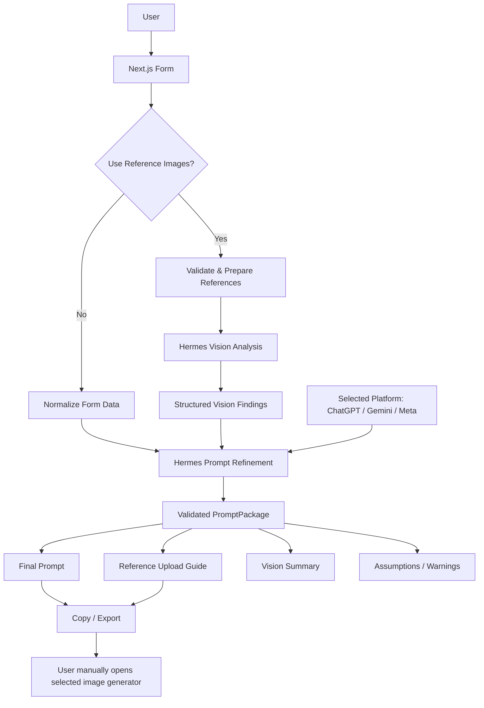

# Job Vacancy Prompt Builder — Implementation Plan V2 (Hermes Brain + Optional Vision)

## 1. Ringkasan PRD

Aplikasi web internal untuk menyusun **prompt image generation yang siap dipakai** berdasarkan data form lowongan kerja dan, jika dipilih user, gambar referensi.

Aplikasi **tidak melakukan image generation secara langsung**.

Hermes Agent berfungsi sebagai **AI brain / prompt refinement engine** yang:

1. menerima data form yang sudah dinormalisasi,
2. secara opsional menganalisis gambar referensi menggunakan vision,
3. memahami fungsi setiap gambar referensi,
4. menyempurnakan visual brief,
5. menyesuaikan struktur prompt berdasarkan platform image generator yang dipilih user,
6. mengembalikan **satu prompt final** yang siap di-copy,
7. mengembalikan panduan gambar referensi apa saja yang perlu di-upload ke platform tujuan.

### Scope V2

```text
FORM
  ↓
PILIH TARGET PLATFORM
  ↓
PILIH: GUNAKAN GAMBAR REFERENSI? YA / TIDAK
  ↓
NORMALIZE & VALIDATE INPUT
  ↓
[Jika YA] HERMES VISION ANALYSIS
  ↓
HERMES PROMPT REFINEMENT
  ↓
1 FINAL PLATFORM-SPECIFIC PROMPT
  +
REFERENCE UPLOAD GUIDE (jika ada)
  ↓
COPY / EXPORT / SAVE HISTORY
```

### Bukan Scope V2

V2 **tidak** melakukan:

- generate gambar melalui OpenAI / Gemini / Meta API,
- preview generated image,
- download generated image,
- image quality Standard / HD,
- billing / cost estimation image generation,
- provider router untuk image generation,
- preset brand bawaan,
- hardcoded brand tertentu.

---

# 2. Prinsip Produk

## 2.1 Generic / Brand-Neutral

Aplikasi tidak memiliki preset brand atau data brand bawaan.

Hapus konsep:

- preset brand bawaan,
- brand dropdown,
- brand auto-fill,
- `config/brands.ts`,
- hardcoded brand colors / brand description.

Jika user membutuhkan identitas tertentu, user dapat menyampaikannya melalui:

- Color Direction,
- Additional Visual Instructions,
- gambar logo sebagai reference image,
- style reference.

Aplikasi tetap bersifat generic dan dapat dipakai untuk perusahaan / organisasi apa pun.

---

## 2.2 Hanya Satu Platform Prompt per Generation

User harus memilih target image generator **sebelum** membangun prompt.

Pilihan V2:

- ChatGPT
- Gemini
- Meta AI

Optional future-safe value:

- Generic / Other

Aplikasi **tidak menampilkan ketiga prompt sekaligus**.

Contoh:

```text
Target Platform

● ChatGPT
○ Gemini
○ Meta AI
```

Jika user memilih ChatGPT, Hermes hanya mengembalikan prompt versi ChatGPT.

Jika kemudian user mengganti target menjadi Gemini, user harus menjalankan **Build Prompt** kembali sehingga Hermes membuat versi Gemini.

Benefit:

- UI lebih sederhana,
- output tidak membingungkan,
- token Hermes lebih hemat,
- prompt dapat dioptimalkan khusus platform tujuan,
- tidak menghasilkan output yang tidak digunakan.

---

## 2.3 Reference Image adalah Optional Mode

Di bagian awal form tampilkan pilihan:

```text
Gunakan Gambar Referensi?

○ Tidak
● Ya — Analisis dengan Hermes Vision
```

### Mode A — Tanpa Reference Image

Flow:

```text
Form
 ↓
Hermes Prompt Refinement
 ↓
Final Prompt
```

Tidak ada file image yang dikirim ke Hermes.

### Mode B — Dengan Reference Image

Flow:

```text
Form
+
Reference Images
 ↓
Hermes Vision Analysis
 ↓
Structured Vision Findings
 ↓
Hermes Prompt Refinement
 ↓
Final Prompt + Reference Upload Guide
```

Semua komponen upload image hanya tampil saat mode reference image aktif.

---

# 3. Target User Flow

## Step 1 — Pilih Target Platform

Required field:

```text
Target Image Generator

[ ChatGPT ]
[ Gemini  ]
[ Meta AI ]
```

Default boleh `ChatGPT` atau belum terpilih. Untuk menghindari prompt salah platform, rekomendasi: **belum terpilih** dan user wajib memilih.

---

## Step 2 — Pilih Reference Mode

```text
Use Reference Images?

[ No Reference ]
[ Use Reference Images + Hermes Vision ]
```

Default: `No Reference`.

---

## Step 3 — Isi Visual Brief

User mengisi kebutuhan visual melalui form tanpa perlu memahami prompt engineering.

---

## Step 4 — Jika Reference Mode aktif, Upload Gambar

Setiap gambar memiliki:

- thumbnail,
- role,
- optional notes,
- remove button.

Hermes tidak boleh menebak fungsi gambar hanya dari urutan upload. Role harus dikirim eksplisit.

---

## Step 5 — Build Prompt

Button utama:

```text
BUILD PROMPT WITH HERMES
```

Loading state berbeda berdasarkan proses:

```text
Validating input...
Analyzing references...
Refining prompt for Gemini...
Finalizing prompt...
```

Jika reference mode OFF, state `Analyzing references...` dilewati.

---

## Step 6 — Output

Output utama hanya terdiri dari:

1. target platform,
2. final prompt,
3. reference upload guide jika reference mode aktif,
4. optional vision summary,
5. notes / warnings jika diperlukan,
6. copy / export actions.

---

# 4. Form Specification

## 4.1 Generator Settings

### Target Platform — Required

Type:

```ts
type TargetPlatform = "chatgpt" | "gemini" | "meta";
```

UI:

- segmented control atau cards,
- tampil di bagian paling atas,
- hanya satu dapat dipilih.

### Use Reference Images — Required

Type:

```ts
useReferenceImages: boolean;
```

Jika `false`:

- sembunyikan seluruh Reference Images section,
- jangan kirim image payload ke backend/Hermes.

Jika `true`:

- tampilkan dynamic reference uploader,
- minimum 1 gambar sebelum Build Prompt.

---

## 4.2 Job / Subject

### Job Position — Required

Contoh:

- Admin Gudang
- Barista
- Marketing Staff
- Accounting
- Graphic Designer

### Gender / Model

Pilihan:

- Male
- Female
- Auto / No Preference

### Age Range

Optional free text atau dua numeric fields.

Contoh:

```text
20-27
```

### Number of People

Optional.

Default:

```text
1
```

### Model Appearance Notes

Optional textarea.

Contoh:

```text
Young Indonesian professional, friendly but confident appearance.
```

Jangan hardcode ciri fisik yang tidak diminta user.

### Pose / Action

Optional textarea.

Contoh:

```text
Standing confidently while holding a clipboard and checking inventory.
```

---

## 4.3 Environment & Props

### Environment / Background — Required

Textarea.

Contoh:

```text
Clean modern warehouse with organized inventory racks.
```

### Supporting Props

Optional textarea.

Contoh:

```text
Clipboard, laptop, stacked boxes, inventory labels.
```

### Additional Scene Details

Optional textarea.

Untuk detail yang tidak cocok di field lain.

---

## 4.4 Visual Direction

### Visual Mood

Options:

- Professional
- Modern
- Young & Energetic
- Warm
- Corporate
- Minimal
- Premium
- Casual
- Custom

Jika `Custom`, tampilkan textarea.

### Photography / Image Style

Options:

- Commercial Photography
- Editorial Photography
- Cinematic
- Studio Portrait
- Lifestyle
- Photorealistic
- Illustration
- 3D Render
- Custom

### Lighting

Options:

- Auto
- Soft Commercial
- Natural Daylight
- Studio
- Dramatic
- Warm
- Bright Clean
- Custom

### Color Direction

Tidak terkait brand preset.

Input:

- Primary color optional,
- Secondary color optional,
- free-text color direction optional.

Contoh:

```text
Dominant warm red with neutral cream accents.
```

### Composition

Options:

- Auto
- Subject Left / Text Space Right
- Subject Right / Text Space Left
- Subject Center / Space Top
- Wide Negative Space
- Custom

### Output Ratio

Options:

- 1:1
- 4:5
- 9:16
- 16:9

Default:

```text
4:5
```

---

# 5. Poster Copy Context

Section ini bersifat optional.

Data ini **bukan untuk meminta AI merender teks poster**.

Data hanya membantu Hermes menentukan:

- kebutuhan negative space,
- kepadatan layout,
- posisi subjek,
- ruang yang harus dibiarkan bersih.

Fields:

### Headline

Contoh:

```text
WE'RE HIRING
```

### Location

Optional.

### Requirements

Dynamic list.

Contoh:

- Maximum 27 years old
- Proficient in Excel
- Detail oriented

### CTA

Optional.

Contoh:

```text
Apply Now
```

### Important Rule

Hermes harus diberi instruksi:

> Poster copy is layout context only. Do not instruct the image generator to render this copy into the generated image unless the user explicitly enables a future "Generate Text in Image" feature.

V2 tidak memiliki fitur tersebut.

---

# 6. Reference Image System

Section hanya muncul saat `useReferenceImages = true`.

## 6.1 Dynamic Reference List

User dapat menambahkan beberapa reference image.

Recommended V2 limit:

```text
Maximum 5 images
Maximum 5 MB per image
```

Supported formats:

- JPG
- JPEG
- PNG
- WEBP

Limit harus menjadi constant/config agar mudah diubah.

---

## 6.2 Reference Role

Setiap image wajib memiliki role.

```ts
type ReferenceRole =
  | "uniform"
  | "model_pose"
  | "environment"
  | "props_object"
  | "visual_style"
  | "logo_identity"
  | "other";
```

UI role labels:

- Uniform / Clothing
- Model / Pose
- Environment / Background
- Props / Object
- Visual Style
- Logo / Visual Identity
- Other

Jika `Other`, wajib isi role description.

---

## 6.3 Reference Notes

Setiap gambar memiliki optional notes.

Contoh:

```text
Follow the shirt shape, collar, dominant color and chest placement from this reference. Do not copy the person's face.
```

Notes merupakan **user intent** dan harus memiliki prioritas lebih tinggi dibanding inferensi vision Hermes jika keduanya konflik.

---

## 6.4 Reference ID

Setiap gambar diberi stable reference ID secara otomatis:

```text
REF-01
REF-02
REF-03
```

ID ini dipakai di:

- request ke Hermes,
- vision analysis,
- final prompt,
- reference upload guide,
- UI thumbnail.

Jangan bergantung pada original filename untuk identitas internal.

---

# 7. Hermes Vision Architecture

## 7.1 Prinsip

Hermes menjadi satu-satunya AI brain aplikasi.

Aplikasi tidak berkomunikasi langsung dengan ChatGPT, Gemini, atau Meta AI untuk menghasilkan gambar.

Target platform hanya digunakan sebagai **prompt output profile**.

---

## 7.2 Two-Step Hermes Pipeline

Untuk reference mode ON, gunakan dua tahap agar hasil lebih stabil dan mudah di-debug.

### STEP A — Vision Analysis

Input:

- reference images,
- reference ID,
- reference role,
- user notes,
- job/scene context secukupnya.

Output berupa structured findings.

Contoh internal result:

```json
{
  "references": [
    {
      "id": "REF-01",
      "role": "uniform",
      "observations": [
        "red short-sleeve polo shirt",
        "dark contrasting collar",
        "small chest graphic on left side"
      ],
      "preserve": [
        "shirt silhouette",
        "dominant red color",
        "collar contrast"
      ],
      "avoidAssuming": [
        "exact unreadable logo text"
      ],
      "confidence": "high"
    }
  ]
}
```

### STEP B — Prompt Refinement

Input:

- normalized form data,
- target platform,
- vision findings jika ada,
- reference user notes,
- system prompt rules.

Output:

- **one final prompt** for selected platform,
- reference upload guide,
- assumptions / warnings.

### Benefit Two-Step Pipeline

- gambar tidak perlu dikirim dua kali,
- hasil vision dapat diinspeksi,
- prompt generation lebih deterministic,
- error vision dan error prompt refinement dapat dibedakan,
- reference intent lebih mudah dipertahankan,
- hemat bandwidth dibanding mengirim image kembali pada tahap refinement.

---

## 7.3 Reference Mode OFF

Jika tidak menggunakan reference image:

```text
Skip Vision Analysis
       ↓
Direct Prompt Refinement
```

Hermes tidak boleh membuat seolah-olah ada reference image.

Final output tidak menampilkan Reference Upload Guide.

---

# 8. Target Platform Adapter

## 8.1 Tujuan

Perbedaan target platform jangan tersebar di banyak component.

Buat centralized configuration:

```text
config/platforms.ts
```

Contoh interface:

```ts
interface PlatformPromptProfile {
  id: TargetPlatform;
  label: string;
  outputStyleInstruction: string;
  referenceInstructionStyle: string;
}
```

---

## 8.2 Platform Behavior

Hermes menerima hanya platform yang dipilih.

### ChatGPT

Fokus output:

- clear natural-language instruction,
- structured visual hierarchy,
- explicit image reference roles,
- composition and negative-space instruction jelas.

### Gemini

Fokus output:

- explicit relationship between each image reference and intended usage,
- preserve vs inspire distinction jelas,
- scene and subject consistency.

### Meta AI

Fokus output:

- concise but complete visual instruction,
- avoid unnecessary prompt-engineering syntax,
- prioritize subject, scene, composition, and reference intent.

### Important

Platform profiles harus dianggap configurable, bukan permanen.

Jangan menyebar wording spesifik platform ke UI components.

---

# 9. Final Output Schema

Backend harus meminta Hermes menghasilkan format terstruktur yang dapat divalidasi.

Recommended TypeScript model:

```ts
interface PromptPackage {
  platform: TargetPlatform;
  finalPrompt: string;
  aspectRatio: OutputRatio;
  usedReferences: boolean;
  referenceGuide: ReferenceGuideItem[];
  visionSummary?: VisionSummary;
  assumptions: string[];
  warnings: string[];
  createdAt: string;
}

interface ReferenceGuideItem {
  referenceId: string;
  role: ReferenceRole;
  uploadOrder: number;
  instruction: string;
}
```

### Important Output Rule

`finalPrompt` harus sudah **self-contained dan siap copy-paste**.

User tidak perlu menyusun ulang:

```text
prompt + negative prompt + composition + reference instruction
```

Semua instruksi penting sudah masuk ke `finalPrompt`.

`referenceGuide` hanya menjelaskan cara upload / fungsi gambar referensi.

---

# 10. Output UI

Panel kanan berubah dari Image Preview menjadi **Prompt Result Panel**.

## Empty State

```text
Your optimized prompt will appear here.

Choose a platform, complete the visual brief,
and build the prompt with Hermes.
```

## Processing State

Tampilkan progress step:

```text
✓ Validating brief
✓ Analyzing 3 references
● Optimizing for Gemini
○ Finalizing output
```

## Ready State

Header:

```text
Prompt Ready for Gemini
```

Isi:

### Final Prompt

Large scrollable text area/card.

Actions:

- Copy Prompt
- Edit Result
- Build Again
- Save to History
- Export TXT

### Reference Upload Guide

Hanya tampil jika reference mode ON.

Contoh:

```text
1. REF-01 — Uniform / Clothing
   Upload as the main clothing reference.

2. REF-02 — Environment
   Use only for warehouse atmosphere and shelving style.

3. REF-03 — Model / Pose
   Use only for body pose; do not copy clothing.
```

### Vision Analysis

Collapsible.

Default collapsed.

Tujuan:

- transparansi,
- debugging,
- user bisa mengecek apakah Hermes salah memahami reference.

Jika user menemukan analisis salah, user dapat mengubah `Reference Notes` lalu Build Again.

### Assumptions / Warnings

Hanya tampil jika tidak kosong.

Contoh warning:

```text
The logo text in REF-01 is too small to read reliably.
The final prompt tells the generator to preserve placement but not recreate unreadable text.
```

---

# 11. Edit Result Mode

V2 menyediakan edit sederhana setelah Hermes menghasilkan prompt.

User dapat mengedit `finalPrompt` secara manual sebelum copy/export.

Perubahan manual **tidak otomatis dikirim kembali ke Hermes**.

Optional button:

```text
Refine Again with Hermes
```

Jika dipilih, aplikasi mengirim:

- previous final prompt,
- user correction instruction.

Contoh:

```text
Make the environment less busy and move the model to the right.
```

Ini menjadi single follow-up refinement tanpa harus mengisi ulang form.

---

# 12. Hermes Integration

## 12.1 API Strategy

Gunakan server-side Hermes client.

Frontend **tidak boleh** memanggil Hermes API secara langsung.

Flow:

```text
Browser
 ↓
Next.js Route Handler
 ↓
Hermes Client
 ↓
Hermes API Server
```

Recommended environment:

```env
HERMES_BASE_URL=http://127.0.0.1:8642/v1
HERMES_API_KEY=change-me
HERMES_MODEL=hermes-agent
```

URL aktual menyesuaikan deployment.

---

## 12.2 Endpoint

Primary integration V2:

```text
POST {HERMES_BASE_URL}/chat/completions
```

Gunakan request server-to-server.

Untuk vision, user message content dikirim sebagai kombinasi text + inline image content.

Image dapat dikonversi oleh Next.js backend menjadi data URL setelah lolos validasi.

---

## 12.3 Hermes Client Files

```text
lib/hermes/
├── client.ts
├── analyzeReferences.ts
├── refinePrompt.ts
├── schemas.ts
├── parseHermesJson.ts
└── prompts/
    ├── visionSystemPrompt.ts
    └── refinementSystemPrompt.ts
```

---

## 12.4 Robust JSON Parsing

Jangan mengasumsikan LLM selalu menghasilkan JSON sempurna.

Implement:

1. request explicit JSON-only response,
2. extract fenced JSON jika ada,
3. parse,
4. validate menggunakan Zod,
5. jika invalid, lakukan maksimal satu repair request ke Hermes,
6. jika tetap invalid, tampilkan user-friendly error.

Jangan silently menggunakan malformed data.

---

# 13. System Prompt — Vision Analyzer

Tujuan system prompt:

Hermes harus menganalisis reference image sesuai **role dan user intent**, bukan membuat deskripsi gambar generik.

Rules minimum:

1. Analyze only visually observable details.
2. Respect the user-defined role for each image.
3. User notes override ambiguous visual inference.
4. Separate `observations`, `preserve`, and `doNotCopy`.
5. Do not identify unknown people.
6. Do not invent unreadable logo/text.
7. Do not infer hidden details.
8. Mention low confidence when uncertain.
9. Return strict structured JSON.
10. Analysis is intended to help another image generator understand how to use the reference.

---

# 14. System Prompt — Prompt Refinement Agent

Hermes bertindak sebagai **expert image-generation prompt engineer for recruitment visuals**.

Rules minimum:

1. Convert normalized form data into a polished final image-generation prompt.
2. Optimize only for the selected target platform.
3. Produce exactly one final prompt.
4. Never produce prompts for unselected platforms.
5. If references exist, explicitly assign their roles.
6. Distinguish `preserve`, `inspired by`, and `do not copy` behavior.
7. Prioritize user notes over vision inference.
8. Include subject, job context, pose, wardrobe/reference direction, scene, props, lighting, color, style, composition, negative space, realism/quality, and relevant avoid-instructions.
9. Do not ask the generator to render recruitment typography, requirements, phone number, QR code, or CTA into the image.
10. Use poster-copy data only to determine negative-space requirements.
11. Do not add logos, text, props, people, or visual elements not requested or reasonably necessary.
12. If a form field is empty, do not invent unnecessary specifics.
13. Avoid conflicting instructions.
14. Keep the final prompt detailed but usable, not bloated.
15. Return strict structured JSON matching `PromptPackage`.

---

# 15. Smart Prompt Logic

Local application logic harus tetap membantu Hermes sebelum request dikirim.

Hermes bukan alasan untuk mengirim form mentah tanpa struktur.

Create:

```text
lib/prompt/normalizeFormData.ts
```

Responsibilities:

- trim empty fields,
- normalize enums,
- convert requirements into layout-density metadata,
- calculate text-space need,
- map ratio to composition context,
- assemble reference metadata,
- remove empty optional fields.

Example derived value:

```ts
posterTextDensity: "low" | "medium" | "high";
```

Contoh:

- headline only → low,
- headline + location + 3 requirements → medium,
- long requirements + CTA → high.

Hermes menggunakan density untuk negative space, bukan untuk menggambar teks.

---

# 16. API Routes

## [NEW] `/api/prompt/build`

Method:

```text
POST multipart/form-data
```

Responsibilities:

1. parse form,
2. validate target platform,
3. validate fields,
4. validate reference toggle,
5. validate image files,
6. normalize form data,
7. if references ON → call Hermes vision analysis,
8. call Hermes prompt refinement,
9. validate PromptPackage,
10. return structured output.

---

## [NEW] `/api/prompt/refine`

Optional V2 refinement endpoint.

Input:

- previous final prompt,
- target platform,
- correction instruction,
- existing reference summary.

Output:

- updated PromptPackage.

Tidak perlu mengirim image files ulang kecuali user mengganti reference image.

---

## [NEW] `/api/hermes/health`

Server-side health check untuk memastikan Hermes dapat diakses.

UI dapat menampilkan status sederhana:

```text
Hermes: Connected
```

atau:

```text
Hermes: Unavailable
```

Jangan expose API key atau internal server details ke browser.

---

# 17. TypeScript Types

## `types/index.ts`

Minimal:

```ts
export type TargetPlatform = "chatgpt" | "gemini" | "meta";
export type GenderOption = "male" | "female" | "auto";
export type OutputRatio = "1:1" | "4:5" | "9:16" | "16:9";

export interface VacancyFormData {
  targetPlatform: TargetPlatform;
  useReferenceImages: boolean;

  jobPosition: string;
  gender: GenderOption;
  ageRange?: string;
  numberOfPeople?: number;
  appearanceNotes?: string;
  poseDescription?: string;

  environment: string;
  props?: string;
  additionalSceneDetails?: string;

  visualMood?: string;
  imageStyle?: string;
  lighting?: string;
  primaryColor?: string;
  secondaryColor?: string;
  colorDirection?: string;
  composition?: string;
  aspectRatio: OutputRatio;

  headline?: string;
  location?: string;
  requirements: string[];
  cta?: string;

  additionalInstructions?: string;
}
```

Reference file metadata dipisahkan dari serializable form state.

---

# 18. Proposed Project Structure

```text
project/
├── app/
│   ├── api/
│   │   ├── prompt/
│   │   │   ├── build/
│   │   │   │   └── route.ts
│   │   │   └── refine/
│   │   │       └── route.ts
│   │   └── hermes/
│   │       └── health/
│   │           └── route.ts
│   ├── globals.css
│   ├── layout.tsx
│   └── page.tsx
│
├── components/
│   ├── form/
│   │   ├── GeneratorSettings.tsx
│   │   ├── TargetPlatformSelect.tsx
│   │   ├── ReferenceModeToggle.tsx
│   │   ├── JobSubjectSection.tsx
│   │   ├── EnvironmentSection.tsx
│   │   ├── VisualDirectionSection.tsx
│   │   ├── PosterCopySection.tsx
│   │   ├── ReferenceImagesSection.tsx
│   │   ├── ReferenceImageCard.tsx
│   │   ├── RequirementsList.tsx
│   │   └── VacancyForm.tsx
│   │
│   ├── output/
│   │   ├── PromptResultPanel.tsx
│   │   ├── FinalPromptCard.tsx
│   │   ├── ReferenceGuide.tsx
│   │   ├── VisionSummary.tsx
│   │   ├── PromptWarnings.tsx
│   │   └── ProcessingSteps.tsx
│   │
│   ├── history/
│   │   └── PromptHistory.tsx
│   │
│   └── presets/
│       └── PresetManager.tsx
│
├── config/
│   ├── platforms.ts
│   ├── referenceRoles.ts
│   └── appLimits.ts
│
├── lib/
│   ├── hermes/
│   │   ├── client.ts
│   │   ├── analyzeReferences.ts
│   │   ├── refinePrompt.ts
│   │   ├── parseHermesJson.ts
│   │   ├── schemas.ts
│   │   └── prompts/
│   │       ├── visionSystemPrompt.ts
│   │       └── refinementSystemPrompt.ts
│   │
│   ├── prompt/
│   │   ├── normalizeFormData.ts
│   │   ├── calculateTextDensity.ts
│   │   └── buildHermesContext.ts
│   │
│   ├── files/
│   │   ├── validateImage.ts
│   │   └── imageToDataUrl.ts
│   │
│   ├── storage/
│   │   ├── formState.ts
│   │   ├── promptHistory.ts
│   │   └── presets.ts
│   │
│   └── validation.ts
│
├── types/
│   ├── index.ts
│   ├── references.ts
│   ├── vision.ts
│   └── promptPackage.ts
│
├── .env.example
├── .env.local
└── implementation_plan_v2_hermes.md
```

---

# 19. Existing Project Migration

Karena project sebelumnya sudah dibuat berdasarkan architecture direct image generation, jangan membuat project baru dari nol jika struktur Next.js existing masih sehat.

Codex harus terlebih dahulu audit repository yang ada.

## Remove / Deprecate

Hapus atau nonaktifkan jika sudah ada:

```text
config/brands.ts
lib/image/
lib/image/providers/openai.ts
lib/image/providers/gemini.ts
lib/image/providers/mock.ts
app/api/generate/route.ts
components/preview/PreviewPanel.tsx
```

Remove concepts:

- ImageProvider interface,
- `IMAGE_PROVIDER`,
- `OPENAI_API_KEY` khusus image generation,
- `GEMINI_API_KEY` khusus image generation,
- mock generated image,
- generated image history,
- download image,
- Standard / HD quality switch,
- cost estimation per image.

## Preserve / Refactor

Pertahankan jika sudah berfungsi:

- Next.js project setup,
- TypeScript,
- Tailwind,
- responsive layout,
- form component patterns,
- image upload component,
- requirements dynamic list,
- localStorage auto-save,
- preset manager,
- prompt preview concept,
- validation utilities.

Refactor:

```text
GenerationHistory → PromptHistory
PreviewPanel → PromptResultPanel
buildImagePrompt → normalize/build Hermes context
```

---

# 20. Auto-save, Presets & History

## Auto-save Form State

Keep V2.

Save serializable form fields ke `localStorage`.

Jangan menyimpan raw image base64 ke localStorage.

File references hilang saat refresh dan UI harus menjelaskan bahwa images perlu di-upload ulang.

---

## Presets

Keep V2.

Preset menyimpan form configuration seperti:

- target platform optional,
- job settings,
- environment,
- visual direction,
- poster layout settings.

Preset **tidak menyimpan image file binary**.

---

## Prompt History

Ganti Generation History menjadi Prompt History.

Simpan:

- timestamp,
- target platform,
- form summary,
- final prompt,
- reference role metadata tanpa image binary,
- assumptions/warnings.

History dapat:

- reopen,
- copy prompt,
- duplicate as new brief,
- delete.

---

# 21. Export

## V2 Required

- Copy Prompt
- Export `.txt`
- Copy Reference Guide

## V2 Recommended

Tambahkan **Export Prompt Package** yang menghasilkan ZIP lokal berisi:

```text
prompt.txt
reference-guide.txt
REF-01-original.ext
REF-02-original.ext
...
```

Tujuan:

User dapat membuka ChatGPT / Gemini / Meta AI kemudian:

1. upload reference files dari package,
2. paste `prompt.txt`.

Tidak ada API image generator yang diperlukan.

Jika ZIP dianggap terlalu besar untuk implementasi awal V2, implement setelah core flow stabil tetapi masih dalam milestone V2.

---

# 22. Error States

Aplikasi harus memiliki error yang spesifik.

## Validation Error

Contoh:

```text
Please select a target image generator.
```

## Reference Error

```text
Reference mode is enabled. Upload at least one reference image.
```

## Vision Error

```text
Hermes could not analyze the reference images.
Check that the active Hermes model/provider supports vision, or continue without reference images.
```

## Hermes Connection Error

```text
Hermes is currently unavailable. Please check the Hermes server connection.
```

## Hermes Output Parse Error

```text
Hermes returned an invalid response format. Please try building the prompt again.
```

## Partial Vision Failure

Jika satu reference gagal dianalisis tetapi lainnya berhasil:

- jangan diam-diam lanjut,
- tampilkan reference mana yang gagal,
- user dapat remove/re-upload atau continue only if explicitly allowed by UI.

---

# 23. Security

## Hermes API Key

`HERMES_API_KEY` hanya server-side.

Jangan gunakan prefix `NEXT_PUBLIC_`.

Frontend tidak pernah menerima key.

---

## Server-to-Server

Browser memanggil Next.js backend.

Next.js backend memanggil Hermes.

Jangan expose Hermes port langsung ke public browser jika tidak diperlukan.

---

## Image Handling

V2 default behavior:

- validate MIME type,
- validate size,
- process temporarily in memory,
- send to Hermes,
- do not persist image unless explicit future storage feature ditambahkan.

Do not log raw base64 image payloads.

---

## Hermes Privileges

Aplikasi ini hanya membutuhkan reasoning/vision/prompt output.

System prompt harus melarang Hermes menggunakan unrelated tools untuk request ini kecuali memang diperlukan.

Jika memungkinkan pada deployment Hermes, gunakan profile khusus untuk aplikasi prompt builder agar behavior dan permission terisolasi dari agent personal utama.

---

# 24. Environment Variables

`.env.example`:

```env
# Hermes Agent API
HERMES_BASE_URL=http://127.0.0.1:8642/v1
HERMES_API_KEY=change-me
HERMES_MODEL=hermes-agent

# Request behavior
HERMES_REQUEST_TIMEOUT_MS=120000

# Optional feature flags
NEXT_PUBLIC_ENABLE_PROMPT_HISTORY=true
NEXT_PUBLIC_ENABLE_PRESETS=true
NEXT_PUBLIC_ENABLE_EXPORT_PACKAGE=true
```

Tidak ada:

```text
IMAGE_PROVIDER
OPENAI_API_KEY
GEMINI_API_KEY
```

untuk direct image generation.

---

# 25. UI / UX Direction

Keep existing visual direction jika UI saat ini sudah baik.

Recommended:

| Area | Direction |
|---|---|
| Theme | Dark neutral / professional |
| Layout Desktop | 55% Form / 45% Prompt Result |
| Result Panel | Sticky |
| Mobile | Stack form → result |
| Primary CTA | Build Prompt with Hermes |
| Reference Toggle | Prominent near top |
| Platform Selection | Prominent near top |
| Vision Summary | Collapsed by default |
| Advanced Fields | Collapsible |

### UI Priority

Bagian atas tidak boleh ramai.

Urutan awal:

```text
1. Target Platform
2. Use Reference Images?
3. Job Position
4. Model
5. Environment
```

Advanced settings berada setelah core brief.

---

# 26. Application State Machine

Recommended states:

```ts
type BuildState =
  | "idle"
  | "validating"
  | "analyzing_references"
  | "refining_prompt"
  | "finalizing"
  | "ready"
  | "error";
```

Reference mode OFF:

```text
idle
→ validating
→ refining_prompt
→ finalizing
→ ready
```

Reference mode ON:

```text
idle
→ validating
→ analyzing_references
→ refining_prompt
→ finalizing
→ ready
```

---

# 27. Verification Plan

## Automated

### TypeScript

```bash
npx tsc --noEmit
```

### ESLint

```bash
npm run lint
```

### Production Build

```bash
npm run build
```

### Unit Tests

Minimum test coverage:

1. `normalizeFormData()` removes empty optional values.
2. poster text density calculated correctly.
3. reference mode OFF rejects/ignores image payloads.
4. reference mode ON requires minimum 1 valid image.
5. image MIME/size validation.
6. each reference has stable ID + role.
7. platform selection only returns one target platform.
8. Hermes JSON parser handles valid JSON.
9. Hermes JSON parser handles fenced JSON.
10. malformed response triggers repair/failure correctly.
11. PromptPackage passes Zod schema.

---

## Manual Functional Tests

### Scenario A — ChatGPT, no reference

1. Select ChatGPT.
2. Select No Reference.
3. Fill job + environment.
4. Build Prompt.
5. Confirm only ChatGPT prompt is displayed.
6. Confirm no Reference Guide.

### Scenario B — Gemini + uniform reference

1. Select Gemini.
2. Enable Reference Images.
3. Upload uniform image.
4. Role = Uniform / Clothing.
5. Add note.
6. Build Prompt.
7. Confirm Hermes vision summary references REF-01.
8. Confirm final prompt contains correct reference role guidance.
9. Confirm Reference Guide says REF-01 should be uploaded.

### Scenario C — Multiple references

Upload:

- REF-01 uniform,
- REF-02 pose,
- REF-03 environment.

Ensure Hermes does not mix their roles.

### Scenario D — Platform switch

1. Generate ChatGPT prompt.
2. Change platform to Meta AI.
3. Build Again.
4. Ensure only Meta AI version replaces/new history entry; Gemini version must not be generated silently.

### Scenario E — Vision unavailable

Enable references while Hermes active model cannot process vision.

Expected:

- clear error,
- no fake visual analysis,
- user can disable reference mode and continue.

### Scenario F — Refresh

Ensure text form state restores.

Ensure uploaded files are not falsely shown as still available after refresh.

---

# 28. Acceptance Criteria V2

V2 dianggap selesai jika seluruh kondisi berikut terpenuhi:

- [ ] Tidak ada preset atau hardcoded brand.
- [ ] User wajib memilih satu target platform.
- [ ] Aplikasi hanya menghasilkan prompt untuk platform yang dipilih.
- [ ] User dapat memilih menggunakan reference image atau tidak.
- [ ] Reference fields tersembunyi saat mode reference OFF.
- [ ] Hermes Vision menganalisis reference image saat mode ON.
- [ ] Setiap reference memiliki stable ID, role, dan optional notes.
- [ ] User notes diprioritaskan di atas ambiguous vision inference.
- [ ] Hermes mengembalikan structured Vision Findings.
- [ ] Hermes mengembalikan validated PromptPackage.
- [ ] Final prompt self-contained dan siap copy-paste.
- [ ] Reference Guide muncul hanya jika diperlukan.
- [ ] Tidak ada direct image generation API.
- [ ] Tidak ada generated image preview/download.
- [ ] Copy Prompt bekerja.
- [ ] Export TXT bekerja.
- [ ] Prompt History bekerja.
- [ ] Auto-save form bekerja tanpa menyimpan raw image binary.
- [ ] Preset bekerja tanpa menyimpan raw image binary.
- [ ] Hermes secret hanya server-side.
- [ ] Vision failure tidak menghasilkan fabricated image analysis.
- [ ] `tsc`, lint, test, dan production build lolos.

---

# 29. Migration Checklist untuk Codex

Urutan pekerjaan yang direkomendasikan:

1. Audit repository saat ini dan catat fitur yang sudah benar-benar selesai.
2. Jangan rewrite project dari nol tanpa alasan.
3. Buat backup / commit sebelum refactor besar.
4. Hapus dependency terhadap direct image generation provider.
5. Hapus preset/hardcoded brand.
6. Refactor types dari `GenerationResult` menjadi `PromptPackage`.
7. Buat platform selector.
8. Buat reference mode toggle.
9. Refactor image upload menjadi dynamic reference image system + roles.
10. Tambahkan Hermes API client server-side.
11. Implement Hermes health check.
12. Implement vision analyzer.
13. Implement prompt refinement agent.
14. Implement strict JSON validation + one repair attempt.
15. Implement `/api/prompt/build`.
16. Replace generated-image preview dengan Prompt Result Panel.
17. Implement copy + export TXT.
18. Refactor history menjadi Prompt History.
19. Preserve and test auto-save/presets.
20. Implement optional refine-again flow.
21. Implement optional ZIP Reference Package.
22. Run automated tests.
23. Run manual scenarios.
24. Run production build.
25. Document environment variables and setup.

---

# 30. Final Architecture



---

# 31. Final Product Definition

V2 bukan **AI image generator**.

V2 adalah:

> **AI-assisted visual prompt builder powered by Hermes Agent, with optional vision analysis and platform-specific prompt optimization.**

Value utama:

```text
User tidak perlu memahami prompt engineering.

User cukup:
- memilih platform,
- menentukan apakah memakai reference,
- mengisi brief,
- mengupload reference jika perlu,
- klik Build Prompt.

Hermes memahami brief + reference,
lalu memberikan satu prompt final yang siap digunakan
bersama reference files di image generator pilihan user.
```

